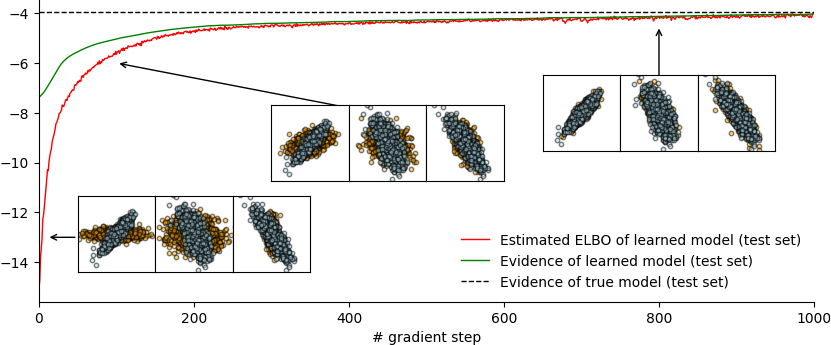
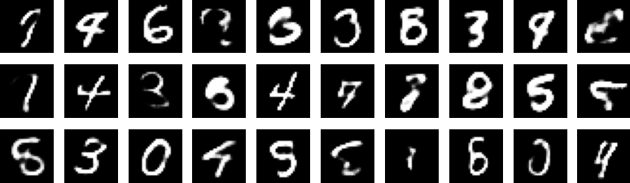
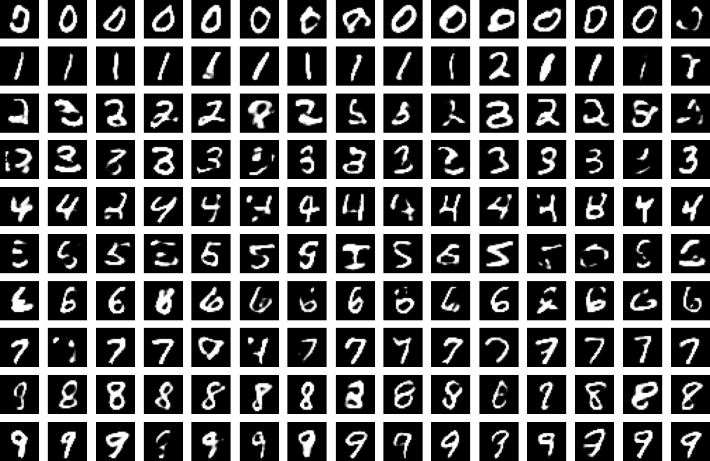
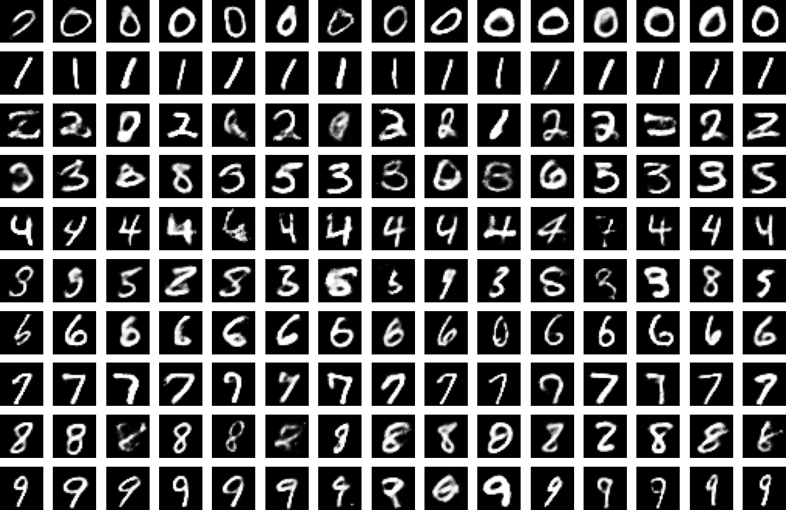

# AEVB Tutorial

## Intro

PyTorch codebase for paper Training Latent Variable Models with Auto-encoding Variational Bayes: A Tutorial.

```bibtex
@misc{https://doi.org/10.48550/arxiv.2208.07818,
  doi = {10.48550/ARXIV.2208.07818},
  
  url = {https://arxiv.org/abs/2208.07818},
  
  author = {Zhi-Han, Yang},
  
  keywords = {Machine Learning (cs.LG), Artificial Intelligence (cs.AI), Machine Learning (stat.ML), FOS: Computer and information sciences, FOS: Computer and information sciences},
  
  title = {Training Latent Variable Models with Auto-encoding Variational Bayes: A Tutorial},
  
  publisher = {arXiv},
  
  year = {2022},
  
  copyright = {Creative Commons Attribution 4.0 International}
}
```

In the tutorial, we motivate the Auto-encoding Variational Bayes (AEVB) algorithm from the classic Expectation Maximization (EM) algorithm, and then derive from scratch the AEVB training procedure for the following models:

- Factor Analysis
- [Variational Auto-Encoder (VAE)](https://arxiv.org/pdf/1312.6114.pdf)
- [Conditional VAE](https://papers.nips.cc/paper/2015/file/8d55a249e6baa5c06772297520da2051-Paper.pdf)
- [Gaussian Mixture VAE by Rui Shu](http://ruishu.io/2016/12/25/gmvae/)
- [Variational RNN](https://papers.nips.cc/paper/2015/file/b618c3210e934362ac261db280128c22-Paper.pdf)

This repo contains minimal PyTorch implementation of these models. Pre-trained models are included for all models except Factor Analysis (which takes less than 10 seconds to train) so it's easy to play around. All other models also take less than 30 minutes to train from scratch. To run the notebooks, create a conda environment, install the required packages with `pip install -r requirements.txt`, and you should be ready.

## Visualizations

(All plots below are created using the notebooks in this repo. It's very likely to get better quality generations if you train longer; I didn't train the models to convergence to save time.)

Factor analysis



Variational Auto-Encoder



Conditional VAE



Gaussian Mixture VAE by Rui Shu (clusters ordered manually in the plot)



Variational RNN


